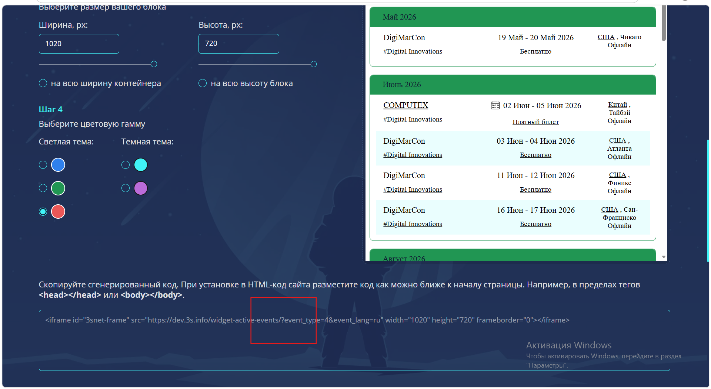

# Баг-репорты

## BUG-01

**Заголовок:** При выборе красной темы в сгенерированном iframe-коде отсутствует параметр `theme`  
**Severity:** Critical  
**Priority:** High  

**Окружение:**  
- URL: `https://dev.3s.info/eventswidget/`  
- Browser: Chrome / Edge 
- Desktop viewport  

**Предусловия:**  
Открыта страница конструктора календаря мероприятий.

**Шаги для воспроизведения:**  
1. Открыть страницу `https://dev.3s.info/eventswidget/`.  
2. Указать параметры виджета.  
3. В блоке **Шаг 4 / Выберите цветовую гамму** выбрать **красную тему**.  
4. Нажать **«Сгенерировать превью»**.  
5. Прокрутить страницу до блока со сгенерированным кодом.  
6. Проверить значение `src` у iframe.

**Фактический результат:**  
Сгенерированный iframe-код не содержит параметр `theme`.

**Ожидаемый результат:**  
В сгенерированном iframe-коде должен присутствовать параметр `theme` с корректным значением, соответствующим выбранной красной теме.

**Воспроизводимость:**  
Always / подтверждается скриншотом.

**Вложения:**  
Скриншот страницы со сгенерированным кодом.

### Скриншот

---

## BUG-02

**Заголовок:** При выборе режима «на всю высоту блока» значение в поле высоты не обновляется до максимального  
**Severity:** Major  
**Priority:** Medium  

**Окружение:**  
- URL: `https://dev.3s.info/eventswidget/`  
- Browser: Chrome / Edge for Windows  
- Desktop viewport  

**Предусловия:**  
Открыта страница конструктора календаря мероприятий.

**Шаги для воспроизведения:**  
1. Открыть страницу `https://dev.3s.info/eventswidget/`.  
2. В блоке **Шаг 3 / Выберите размер вашего блока** вручную указать значение высоты в поле **Высота, px**.  
3. После этого выбрать опцию **«на всю высоту блока»**.  
4. Проверить значение в поле высоты.

**Фактический результат:**  
После выбора режима **«на всю высоту блока»** значение в поле высоты остаётся прежним, введённым вручную.

**Ожидаемый результат:**  
После выбора режима **«на всю высоту блока»** значение в поле высоты должно обновляться в соответствии с выбранным режимом, либо поле должно становиться неактивным/визуально показывать, что используется максимальная высота контейнера.

**Воспроизводимость:**  
Always / требует подтверждения скриншотом.

**Вложения:**  
Скриншот страницы с выбранным режимом высоты и сохранённым ручным значением.

### Скриншот

