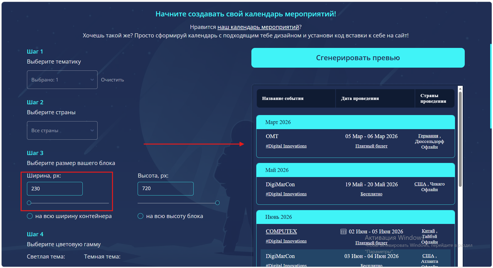
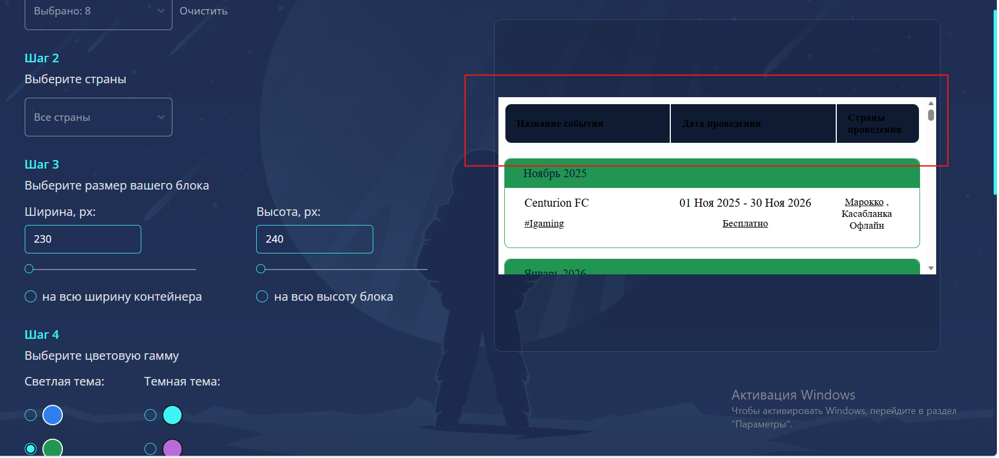
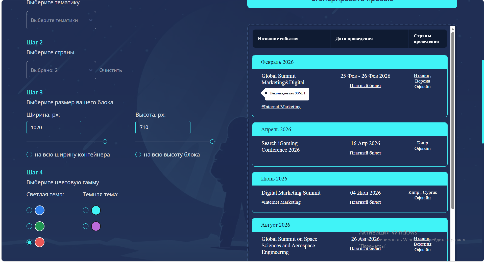

# Баг-репорты

## Функциональные баги

## BUG-01

**Заголовок:** При выборе красной темы в сгенерированном iframe-коде отсутствует параметр `theme`  
**Severity:** Critical  
**Priority:** High  

**Окружение:**  
- URL: `https://dev.3s.info/eventswidget/`  
- Browser: Chrome / Edge 
- Desktop viewport  

**Предусловия:**  
Открыта страница конструктора календаря мероприятий.

**Шаги для воспроизведения:**  
1. Открыть страницу `https://dev.3s.info/eventswidget/`.  
2. Указать параметры виджета.  
3. В блоке **Шаг 4 / Выберите цветовую гамму** выбрать **красную тему**.  
4. Нажать **«Сгенерировать превью»**.  
5. Прокрутить страницу до блока со сгенерированным кодом.  
6. Проверить значение `src` у iframe.

**Фактический результат:**  
Сгенерированный iframe-код не содержит параметр `theme`.

**Ожидаемый результат:**  
В сгенерированном iframe-коде должен присутствовать параметр `theme` с корректным значением, соответствующим выбранной красной теме.

**Воспроизводимость:**  
Always / подтверждается скриншотом.

**Вложения:**  
Скриншот страницы со сгенерированным кодом.

### Скриншот

---

## BUG-02

Заголовок: Отсутствует приоритезация выбора высоты при переключении в режим «на всю высоту блока»
Severity: Major
Priority: Medium

**Окружение:**

URL: https://dev.3s.info/eventswidget/
Browser: Chrome/Edge
Desktop viewport

**Предусловия:**
Страница конструктора календаря мероприятий открыта.

**Шаги для воспроизведения:**

1. Открыть страницу https://dev.3s.info/eventswidget/
2. В блоке Шаг 3 / Выберите размер вашего блока вручную указать значение в поле Высота, px.
3. После этого выбрать опцию «на всю высоту блока».
4. Проверить значение в поле высоты.

**Фактический результат:**
После выбора режима «на всю высоту блока» значение в поле высоты не изменяется и остаётся равным ранее введённому вручную значению.

**Ожидаемый результат:**
При выборе режима «на всю высоту блока» в поле высоты должно устанавливаться максимальное значение, так как данное действие было выполнено после ручного ввода и должно иметь приоритет.

**Воспроизводимость:**
Always / подтверждается скриншотом.

### Скриншот

## BUG-03
Заголовок: Поле «Ширина, px» не влияет на ширину превью
Severity: Major
Priority: High

**Окружение:**

URL: https://dev.3s.info/eventswidget/
Browser: Chrome/Edge for Windows
Desktop viewport
Предусловия:
Страница конструктора календаря мероприятий открыта.

**Шаги для воспроизведения:**

1. Открыть страницу https://dev.3s.info/eventswidget/
2. Указать параметры виджета.
3. В блоке Шаг 3 / Выберите размер вашего блока в поле Ширина, px ввести любое значение, отличное от текущего.
4. Нажать «Сгенерировать превью».
5. Проверить ширину отображаемого превью.

**Фактический результат:**
При изменении значения в поле Ширина, px ширина превью визуально не изменяется.

**Ожидаемый результат:**
При изменении значения в поле Ширина, px и последующей генерации превью ширина отображаемого превью должна изменяться в соответствии с введённым значением.

**Воспроизводимость:**
Always / подтверждается скриншотом.

### Скриншот

## UI/UX баги

## BUG-04
Заголовок: В светлых темах (синяя и зелёная) заголовки таблицы плохо читаются и сливаются с фоном
Severity: Major
Priority: Medium

**Окружение:**

URL: https://dev.3s.info/eventswidget/
Browser: Chrome/Edge
Desktop viewport
Предусловия:
Страница конструктора календаря мероприятий открыта.

**Шаги для воспроизведения:**

1. Открыть страницу https://dev.3s.info/eventswidget/
2. Указать параметры виджета.
3. В блоке Шаг 4 / Выберите цветовую гамму выбрать одну из светлых тем: синюю или зелёную.
4. Нажать «Сгенерировать превью».
5. Проверить отображение заголовков таблицы в превью.
   
**Фактический результат:**
В светлых темах текст заголовков таблицы отображается с недостаточным контрастом и визуально сливается с фоном.

**Ожидаемый результат:**
В светлых темах текст заголовков таблицы должен иметь достаточный контраст относительно фона и легко читаться пользователем.

**Воспроизводимость:**
Always / подтверждается скриншотом.

### Скриншот

## BUG-05
Заголовок: Превью не адаптируется к выбранным настройкам width=100% и height=100%
Severity: Major
Priority: Medium

**Окружение:**

URL: https://dev.3s.info/eventswidget/
Browser: Chrome/Edge
Desktop viewport
Предусловия:
Открыта страница конструктора календаря мероприятий.

**Шаги для воспроизведения:**

1. Открыть страницу https://dev.3s.info/eventswidget/
2. Выбрать любую валидную тематику.
3. В блоке Шаг 3 выбрать:
   ширину контейнера 300
   высоту блока 300
4. ниже выбрать "на всю ширину контейнера" и "на всю высоту блока"
5. Нажать «Сгенерировать превью»

**Фактический результат:**
В generated code выставляются значения width="100%" и height="100%", однако визуальное превью не растягивается на всю ширину и высоту контейнера предпросмотра и отображается как ограниченный по размеру блок.

**Ожидаемый результат:**
Превью должно отражать выбранные настройки размеров и адаптироваться под размер контейнера, либо интерфейс должен явно объяснять, что значение 100% применяется только к встраиваемому виджету на внешнем сайте, а превью отображается в фиксированной демонстрационной области.

**Воспроизводимость:**
Always 

## BUG-06
Заголовок: Светлая тема в превью отображается как тёмная  
**Severity:** Major  
**Priority:** Medium  

**Окружение:**  
* URL: https://dev.3s.info/eventswidget/  
* Browser: Chrome/Edge for Windows  
* Desktop viewport  

**Предусловия:**  
Открыта страница конструктора календаря мероприятий.

**Шаги для воспроизведения:**  
1. Открыть страницу https://dev.3s.info/eventswidget/  
2. Указать параметры виджета.  
3. В блоке **Шаг 4 / Выберите цветовую гамму** выбрать  красную **из светлых тем**.  
4. Нажать **«Сгенерировать превью»**.  
5. Проверить отображение превью.

**Фактический результат:**  
После выбора светлой темы превью визуально отображается в тёмной цветовой гамме.

**Ожидаемый результат:**  
После выбора светлой темы превью должно отображаться в соответствующей светлой цветовой гамме.

**Воспроизводимость:**  
Always / подтверждается скриншотом.

**Вложения:**  
Скриншот страницы, на котором видно, что при выборе светлой темы превью отображается как тёмное.

### Скриншот

